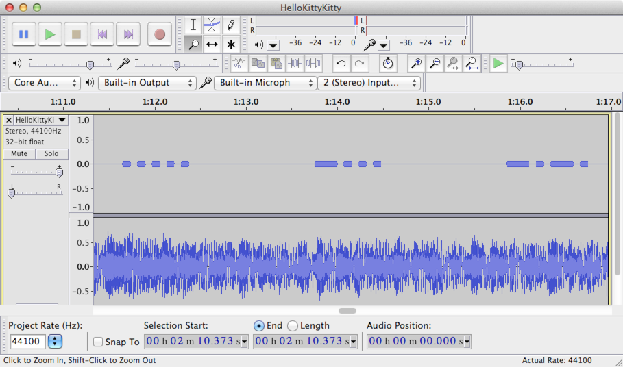

# Nuit du Hack CTF Qualifications: Here, kitty kitty!

**Category:** Steganalysis
**Points:** 50
**Description:**

> I just can't get enough of this sweet melody, I can listen to it for hours! Sometimes I even feel like it is trying to send me a message ..
>
> [`HelloKittyKitty.wav`](HelloKittyKitty.wav)

## Write-up

Opening the file in a sound editor like Audacity reveals that the left audio channel contains something special:



It looks like a morse code. Let’s type it out:

```
..... -... -.-. ----. ..--- ..... -.... ....- ----. -.-. -... ----- .---- ---.. ---.. ..-. ..... ..--- . -.... .---- --... -.. --... ----- ----. ..--- ----. .---- ----. .---- -.-.
```

According to [an online morse decoder](http://morsecode.scphillips.com/jtranslator.html), this translates to:

```
5BC925649CB0188F52E617D70929191C
```

I tried entering this as the flag but it was not accepted. Googling for it [reveals](http://md5.gromweb.com/?md5=5bc925649cb0188f52e617d70929191c) that `5bc925649cb0188f52e617d70929191c` (in lowercase) is the MD5 hash of the string `valar dohaeris`.

The correct flag was `5bc925649cb0188f52e617d70929191c` (in lowercase).

## Other write-ups

* <http://csrc.tamuc.edu/css/?p=143>
